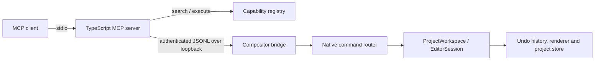

# Compositor MCP

A deep Model Context Protocol integration for [Compositor](https://github.com/robbietilton/Compositor), the native macOS image editor.

The project gives MCP clients a compact `search` + `execute` interface for inspecting and controlling Compositor. Operations run through Compositor's native document model and undo history rather than mouse/keyboard automation.

> **Project status:** private alpha. The architecture and core editor bridge are implemented. The catalogue currently contains **62 typed capabilities: 42 implemented and 20 explicitly marked as planned**. Full one-to-one app parity is the goal, not a claim about this first release.

## What works now

The first release covers:

- editor/project state, open tabs and project selection;
- new, open, save, image import, PNG/JPEG export and canvas flip;
- undo and redo;
- layer selection, creation, duplication, rename, deletion, visibility, opacity, blend mode, ordering, grouping, merge, flip and absolute transform;
- masks, mask linking and clipping masks;
- selection inspection, select all, deselect, invert, load from layer/mask, expand and contract;
- pixel fill, clear and invert;
- full-resolution temporary previews;
- atomic multi-operation batches, dry runs, optimistic preconditions, idempotency keys, rollback through native undo and destructive-action confirmation.

The parity backlog already describes crop/resize, free distort, marquee/lasso/wand, content-aware fill, brush and retouching strokes, gradients, shapes, adjustment layers and filters. See [capability parity](docs/capability-parity.md).

## Architecture



The MCP surface stays at two tools even as the editor grows:

- `search` finds relevant capabilities and returns only the schemas needed for the current task.
- `execute` runs one or more typed operations, with dry-run validation and safety controls.

This avoids exposing dozens or hundreds of full tool schemas in every model context while retaining fine-grained native operations.

## Repository layout

```text
packages/protocol/       Typed capability catalogue, wire types and search
packages/mcp-server/     MCP stdio server and local bridge client
compositor/Compositor/   Swift files installed into the Compositor app
compositor/patches/      Reviewable upstream app-delegate patch
scripts/                 Install, remove, configure and parity checks
docs/                    Architecture, security, protocol and roadmap
examples/                MCP client configurations and request examples
```

## Requirements

- macOS 26
- Xcode 26
- Node.js 20.12 or newer
- a local checkout of Compositor

The Swift integration was prepared against upstream Compositor commit `a19db9011282399785dc18efcfded904627bdcc2`. The installer fails clearly if the app delegate has changed beyond its supported patch points.

## Install

### 1. Install the native bridge into Compositor

The npm package bundles the installer and the Swift bridge sources:

```bash
npx -y compositor-mcp install-bridge /absolute/path/to/Compositor
```

Compositor uses Xcode file-system-synchronised groups, so the Swift files under `Compositor/MCP` are picked up without hand-editing the project file. Open `Compositor.xcodeproj`, select the **Compositor** scheme, build and run it once.

Working from a source checkout instead? `./scripts/install-into-compositor.sh` does the same thing.

### 2. Authorise filesystem roots

File operations are denied unless their paths are inside an explicitly allowed root. The directory containing the currently open `.comp` project is added automatically.

```bash
npx -y compositor-mcp configure "$HOME/Pictures" "$HOME/Downloads"
```

Restart Compositor after changing configuration.

### 3. Verify the setup

```bash
npx -y compositor-mcp doctor
```

`doctor` checks the bridge discovery file, pings the running app, and reports the app version, protocol, implemented capability count, revision and authorised roots.

### 4. Add the MCP server to your client

```json
{
  "mcpServers": {
    "compositor": {
      "command": "npx",
      "args": ["-y", "compositor-mcp"]
    }
  }
}
```

For a development checkout, point the client at the built entry point instead: `node /absolute/path/to/compositor-mcp/packages/mcp-server/dist/index.js`. More examples are in [`examples/`](examples/).

## Using the two tools

Find a capability:

```json
{
  "query": "make the active layer half transparent",
  "limit": 5,
  "includeSchemas": true
}
```

Then execute it:

```json
{
  "operations": [
    {
      "name": "layer.setOpacity",
      "arguments": { "layerId": "active", "opacity": 0.5 }
    }
  ],
  "atomic": true
}
```

Run a safe preview of a destructive batch first:

```json
{
  "operations": [
    { "name": "layer.delete", "arguments": { "layerId": "active" } }
  ],
  "dryRun": true
}
```

The real destructive request must include `"confirmDestructive": true`.

## Security model

- The native listener accepts only loopback peers.
- Every app launch generates a fresh 256-bit bearer token.
- Discovery and audit files are created with owner-only permissions.
- The Node bridge rejects discovery files owned by another user or readable by group/others.
- File reads and writes are constrained to configured roots after symlink resolution.
- Requests are size-limited; responses are size-limited by the companion server.
- Destructive operations require explicit confirmation.
- Batches use native undo grouping and roll back only the history entry created by that batch.
- Every operation can be written to an owner-only JSONL audit log.

See [security](docs/security.md) for the threat model and known limitations.

## Development

```bash
# Run without Compositor using the deterministic mock bridge
COMPOSITOR_MCP_MOCK=1 npm run dev

# Tests and type checking
npm run check

# Confirm the TypeScript catalogue and Swift router agree
npm run parity
```

See [development](docs/development.md) before adding operations. New capabilities should be added to the registry first, then implemented in the Swift router and covered by tests.

## Validation status

The TypeScript projects build and type-check, all 14 protocol/server tests pass, the Swift sources pass parser validation, the capability parity check passes, and the installer/reinstaller/uninstaller smoke test passes. A real AppKit/Xcode build and live bridge test are still required on macOS 26 before calling the native integration production-ready. See [release validation](docs/release-validation.md).

## Uninstall from Compositor

```bash
./scripts/uninstall-from-compositor.sh /absolute/path/to/Compositor
```

## Licensing and trademarks

This integration is MIT-licensed. Compositor is a separate MIT-licensed project by Robbie Tilton. DaVinci Resolve and Blackmagic Design are referenced only as architectural inspiration; this project is not affiliated with or endorsed by Blackmagic Design. See [NOTICE](NOTICE.md).
