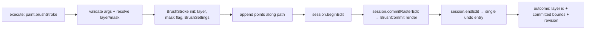
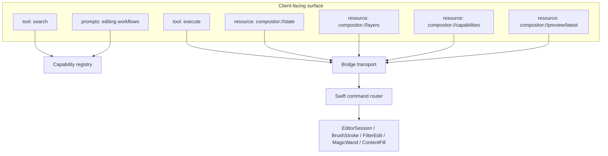

# feat: Deep editor parity and customer-facing distribution for Compositor MCP

## Summary

Take `compositor-mcp` from private alpha (42 of 62 catalogue capabilities implemented, source-build-only, contributor-oriented docs) to a best-in-class MCP surface: every planned capability implemented natively inside Compositor, a richer MCP surface (structured outputs, resources, prompts, image previews), an `npx`-installable package with CLI helpers, and user-facing documentation suitable for an open-source launch.

---

## Problem Frame

The current release has a solid architectural core — a code-mode `search` + `execute` surface over an authenticated loopback bridge — but stops short of "do everything the app can do":

- 20 of 62 catalogue capabilities are `planned` stubs; `execute` rejects them. The missing group is the entire deep-editor surface: crop/resize, free distort, marquee/lasso/wand, content-aware fill, brush/heal/clone/liquify strokes, gradients, shapes, adjustment layers and filters.
- 8 of those 20 planned capabilities (`paint.spotHeal`, `paint.clone`, `paint.blur`, `paint.gradient`, `paint.shape`, `adjustment.add`, `adjustment.update`, `filter.apply`) have **empty input schemas** — the contract itself is unfinished.
- Tool results are text-only JSON: no `structuredContent`, no output schemas, no MCP resources or prompts, no inline image content — so a vision-capable client cannot *see* the canvas it is editing.
- Distribution requires cloning and building from source; every package is `private: true`. There is no `npx` path, no `doctor` command, and no published release story.
- The native install patches `CompositorApplicationDelegate` via string anchors. Upstream has already drifted (new `application(_:open:)`, `applicationWillFinishLaunching`, `applicationShouldTerminate` methods) — it still applies today, but there is no drift detection or upstream engagement path.
- The README is accurate but written for contributors. There is no user quickstart, no generated capability reference, and standard OSS hygiene files (code of conduct, issue/PR templates) are absent.

Reference points confirmed by research: leading creative desktop apps ship native MCP servers letting assistants do real project tasks, with third-party MCP surfaces exposing 295–334 tools for full API coverage; API MCP gateways use the same two-tool `search`/`execute` shape this repo already has — the architecture is right; the depth, surface richness, and distribution are what is missing.

---

## Requirements

| ID | Requirement |
|----|-------------|
| R1 | Every catalogue capability marked `planned` is implemented through Compositor's native document model, renderer, and undo system — no pixel-coordinate or UI-gesture automation. |
| R2 | The MCP surface stays small-context (search + execute) but gains `structuredContent`, output schemas, tool annotations, MCP resources for readable state, and MCP prompts for end-to-end editing workflows. |
| R3 | Agents can complete real editing tasks end-to-end (e.g., "remove the background, place the subject on a new layer, export a web-ready PNG") using workflow prompts and composable operations — the "do everything" bar. |
| R4 | A user can install and run the server via `npx` with one JSON stanza, verify their setup with a `doctor` command, and install/configure the native bridge via CLI — no source build required for the TypeScript side. |
| R5 | The README and docs read as an open-source product page: what it does, quickstart per major client, capability reference, security summary, contribution path — with contributor detail moved under `docs/`. |
| R6 | The existing safety model (loopback-only, bearer token, filesystem allowlist, destructive confirmation, atomic undo grouping, audit log) is preserved and extended to the new operations; every new operation carries correct `read`/`write`/`filesystem`/`destructive` and transactional classifications. |

---

## Key Technical Decisions

1. **Keep the two-tool core; deepen everything around it.** `search` + `execute` already matches the code-mode two-tool shape and scales to arbitrary catalogue size. Depth comes from implementing all operations underneath, plus `structuredContent`/output schemas, MCP resources, prompts, and image content — not from registering one MCP tool per operation.
2. **Synthesize strokes through `BrushStroke`/`WarpStroke`, not UI gestures.** For `paint.*` operations, construct `BrushStroke(layer:mask:settings:canvas:)` directly, `append(_:)` the document-space points, and commit via `session.commitRasterEdit(_:name:)`. Spot heal is `BrushSettings.healing = true` + `healingMode`; clone uses the clone-sample path; smear/liquify uses `WarpStroke`. This avoids tool switching, stays deterministic, and produces normal undo entries.
3. **Selections via `applySelection(shape:mode:name:)`.** Rectangle, ellipse and polygon are generated `CGPath`s combined with `SelectionMode` (replace/add/subtract). Magic wand calls `session.magicWand(at:mode:)` directly with `WandSettings` (tolerance, contiguous, sample size).
4. **Filters and adjustments through the UI's own preview-commit pipeline.** `session.beginFilter(_:)` → `updateFilter(_:preview:)` → `commitFilter()` for `filter.apply`; the same pipeline handles `FilterKind.contentAwareFill` and `removeBackground` (which have their own commit paths). `adjustment.add`/`update` map to `session.addAdjustment(kind)` / `updateAdjustment(_:value:)`. Because these reuse the native pipeline, undo grouping and live-render behaviour come free.
5. **Geometry through session primitives.** Crop = set `session.cropRect` then `commitCrop()`; canvas size = `CanvasSizeOptions`/`CanvasResizer`; image size = `ImageResizer`; distort = `commitDistort(_:corners:)` on a transform edit; mask feather through the layer-mask edit path.
6. **`layer.ungroup` is the only capability with no native primitive.** Compose it: iterate the group's children, `session.placeLayer(_:in: nil, above:)` each into the parent position, then remove the empty group inside one `beginEdit`/`endEdit`. Confirm ordering semantics against `groupSelectedLayers()` during implementation.
7. **One published npm package.** Publish `compositor-mcp` (unscoped) bundling the protocol package's compiled output into `dist/` (tsup or tsc project reference + `files` whitelist), with `bin.compositor-mcp`. This avoids org-scope coupling and gives users a single `npx -y compositor-mcp` command. Name availability is an execution-time check; fallbacks: `compositor-mcp-server`, or `@md-f-sarker/compositor-mcp`.
8. **CLI subcommands in the same entry point.** Default (no args) = serve stdio; `doctor` = check discovery file, ping the bridge, report capability/revision info; `install-bridge <path>` and `configure` = wrap the existing shell scripts so users never touch `scripts/` directly.
9. **Elicitation is additive, never required.** Where the MCP client advertises elicitation support, destructive operations may confirm interactively; `confirmDestructive: true` remains the portable contract and the only path for batch/atomic callers.
10. **Installer hardening, not a new mechanism.** Keep file-copy + anchored insertion, but verify the upstream checkout against the audited commit SHA, warn clearly on drift, and record the resolved SHA in the install report. Ship `docs/upstream-proposal.md` — a ready-to-file issue/PR draft proposing an official bridge entry point to `robbietilton/Compositor` — rather than silently staying a patch.
11. **Generated capability reference.** Add `scripts/generate-capability-docs.mjs` (same pattern as `check-capability-parity.mjs`) that emits `docs/capabilities.md` from the registry, wired into `npm run check`. The README links to it; the catalogue stays the single source of truth so docs cannot drift.

---

## High-Level Technical Design

### Stroke synthesis path (paint.* operations)

The same shape serves `paint.spotHeal` (healing settings), `paint.clone` (clone sample + offset), and `paint.blur` (`WarpStroke` smear/push path). `paint.gradient` uses the `beginGradient`/`moveGradient`/`commitGradient` session flow; `paint.shape` uses `ShapeKind`/`shapeImage` + layer insertion.

### MCP surface after this plan

`preview.render` gains inline `image/png` content in the execute result (size-capped) alongside its path result, so vision clients can inspect renders without filesystem access.

---

## Scope Boundaries

**In scope:** the 20 planned operations (implemented + fully schematized); structured outputs, resources, prompts, annotations; npm/`npx` distribution with CLI helpers; installer hardening; user-facing README + generated capability reference; OSS hygiene files; live macOS validation.

**Out of scope (true non-goals):** remote/networked transports (bridge stays loopback by design); a GUI or preference pane inside Compositor; bundling or re-signing the Compositor binary itself.

### Deferred to Follow-Up Work

- **Bridge protocol v2**: streaming progress notifications and cancellation for long operations (content-aware fill, remove background, large exports). Today the 30 s timeout (`COMPOSITOR_MCP_TIMEOUT_MS`) is the only lever — documented, not a fix.
- **Capability-level permission profiles** (per-operation allow/deny beyond filesystem roots + destructive confirm) — called out in `docs/security.md` as a known limitation.
- **Upstream PR submission**: `docs/upstream-proposal.md` is written here; actually filing the issue/PR against `robbietilton/Compositor` is a separate, human-owned step.
- **Signed/prebuilt Compositor+MCP bundle** for non-developer users.
- **Code-mode `code` tool** (model-written JS composed server-side, a deeper variant of this pattern): worth evaluating after parity lands — the batch/atomic execute already covers most of its value for a stateful local app.

---

## Implementation Units

### U1. Complete the capability catalogue

**Goal:** Every capability carries a real input schema, aliases, tags, and examples — the contract is finished before the implementation lands.

**Requirements:** R1, R6

**Dependencies:** none

**Files:**
- `packages/protocol/src/capabilities.ts`
- `packages/protocol/test/search.test.ts` (extend)
- `scripts/check-capability-parity.mjs` (extend if classification checks need it)
- `scripts/generate-capability-docs.mjs` (new)
- `docs/capabilities.md` (generated, new)

**Approach:** Write strict JSON schemas for the eight planned ops with empty schemas, mirroring upstream parameter models: `spotHeal` (points, size, mode enum from `SpotHealingMode`), `clone` (source point, destination path, aligned, sample all-layers flag, brush settings), `blur`/`liquify` (tool variant from `BrushToolMode`/`BlurToolMode`, path, strength), `gradient` (start/end points, `GradientStyle`/`GradientShape`, colour stops), `shape` (`ShapeKind`, rect, corner radius, colour, fill), `adjustment.add`/`update` (`AdjustmentKind` enum + per-kind typed parameter unions via `oneOf`), `filter.apply` (`FilterKind` enum + `FilterSettings` fields). Add `generate-capability-docs.mjs` emitting a grouped table from the registry and hook it into `npm run check` so `docs/capabilities.md` cannot drift.

**Patterns to follow:** existing `capability()` helper and schema conventions (`layerId`, `projectId`, bounded numbers/arrays) in `capabilities.ts`; the parity-check script shape for the generator.

**Test scenarios:**
- Happy path: every catalogue entry's `examples[].arguments` validates against its `inputSchema` (extend the existing example-validation test to the new schemas).
- Edge: `adjustment.add` with each `AdjustmentKind` value resolves the correct `oneOf` branch; wrong parameter shape for a given kind fails validation with a named path.
- Edge: `filter.apply` with `FilterKind.removeBackground` accepts quality settings; with `gaussianBlur` accepts radius; cross-kind fields are rejected.
- Error: `execute` on a still-`planned` op returns `operation_not_implemented` (unchanged behaviour, regression coverage).
- Integration: `npm run check` regenerates `docs/capabilities.md` and fails if the committed file is stale.

**Verification:** `npm run check` green; `docs/capabilities.md` exists, lists all 62 operations grouped by category with status, and is byte-stable on regeneration.

---

### U2. Geometry and layer-structure operations

**Goal:** Implement `document.resizeCanvas`, `document.resizeImage`, `document.crop`, `layer.ungroup`, `layer.featherMask`, `layer.distort` natively.

**Requirements:** R1, R6

**Dependencies:** U1 (schemas)

**Files:**
- `compositor/Compositor/MCP/CompositorMCPCommandRouter.swift` (implemented set, validate(), apply() cases)
- `packages/mcp-server/test/handlers.test.ts` (extend)
- `packages/mcp-server/src/mock-bridge.ts` (extend mock coverage)
- `docs/capability-parity.md`

**Approach:** Crop sets `session.cropRect` from the validated rect and calls `commitCrop()`; canvas resize builds `CanvasSizeOptions` through `CanvasResizer`; image resize delegates to `ImageResizer`; distort builds the transform edit and calls `commitDistort(_:corners:)` with `DistortWarp.isUsable` validation; ungroup composes `placeLayer(_:in:)` per child then removes the empty group inside one edit transaction; feather mask goes through the layer-mask edit path with the radius in points. All are transactional, undoable via `beginEdit`/`endEdit`; `document.*` ops follow the existing non-transactional classification where upstream semantics require it.

**Test scenarios:**
- Happy path: crop to a rect inside the canvas → document bounds shrink, single undo entry, returned state shows new size.
- Happy path: resizeCanvas anchored `top-left` → layer pixels unscaled, canvas grows to the right/bottom.
- Happy path: distort a layer to four valid corners → transformed placement committed; `DistortWarp.isUsable` rejected corners return `invalid_arguments`.
- Happy path: ungroup a two-layer group → children land at the group's stack position preserving order, group removed.
- Edge: crop rect partially outside canvas → clipped per upstream `CropGeometry` semantics; fully-outside rect → `invalid` error.
- Edge: ungroup on a non-group layer → `invalid`; ungroup nested group → only the top level is dissolved.
- Error: `resizeImage` beyond 30,000 px bounds → `invalid`; `featherMask` on a layer with no mask → `notFound`.
- Integration: atomic batch of crop + layer.transform rolls back cleanly on a forced second-op failure; revision increments.

**Verification:** all six names move from `planned` to `implemented` in the router's implemented set and the catalogue; `npm run parity` agrees; mock + handler tests cover validation and batch behaviour.

---

### U3. Selection tool operations

**Goal:** Implement `selection.rectangle`, `selection.ellipse`, `selection.polygon`, `selection.magicWand`.

**Requirements:** R1, R6

**Dependencies:** U1

**Files:**
- `compositor/Compositor/MCP/CompositorMCPCommandRouter.swift`
- `packages/mcp-server/test/handlers.test.ts`
- `packages/mcp-server/src/mock-bridge.ts`
- `docs/capability-parity.md`

**Approach:** Rect/ellipse/polygon build a `CGPath` in document space and call `session.applySelection(_:mode:name:)` with the `replace`/`add`/`subtract` `SelectionMode`. Wand resolves `WandSettings` (tolerance, contiguous, sample size) and calls `session.magicWand(at:mode:)`, requiring an editable document with pixels at the point. Each returns the same `selection` state snapshot the existing selection ops return.

**Test scenarios:**
- Happy path: rectangle replace → `selection.get` reports bounds equal to the rect.
- Happy path: ellipse add onto an existing selection → combined coverage grows (assert via state bounds).
- Happy path: polygon with 5 points → selection exists; degenerate 2-point polygon → `invalid_arguments` at schema level.
- Happy path: wand at a flat-colour region → selection covers the region; `tolerance` widening expands it.
- Edge: wand on a fully transparent point → upstream "nothing selected" semantics, returned as a clean error or empty selection (match app behaviour).
- Error: add-mode with no existing selection → behaves as replace (match upstream); document required checks fire when no document.
- Integration: rectangle select → `pixels.fill` in one atomic batch produces the filled region and one undo entry.

**Verification:** four names implemented on both sides; parity + tests green.

---

### U4. Painting, retouching, gradient and shape operations

**Goal:** Implement `paint.brushStroke`, `paint.spotHeal`, `paint.clone`, `paint.blur`, `paint.gradient`, `paint.shape` — the deepest unit.

**Requirements:** R1, R6

**Dependencies:** U1, U3 (clone/heal interact with selections)

**Files:**
- `compositor/Compositor/MCP/CompositorMCPCommandRouter.swift`
- Possibly a new `compositor/Compositor/MCP/CompositorMCPPaint.swift` to keep the router readable (router is ~980 lines now)
- `packages/mcp-server/test/handlers.test.ts`
- `packages/mcp-server/src/mock-bridge.ts`
- `docs/capability-parity.md`

**Approach:** Per KTD-2: resolve target layer + mask flag, construct `BrushStroke` (or `WarpStroke` for smear) with validated `BrushSettings` (diameter 1–2000, hardness 0–1, opacity 0.01–1 per upstream bounds), `append` each point, wrap `commitRasterEdit` in one undo transaction named per the upstream action names ("Brush Stroke", "Spot Healing", …). Clone resolves the source point into the clone-sample path before appending the destination path. Gradient calls `beginGradient`/`moveGradient`/`commitGradient` with resolved `GradientSettings`. Shape resolves `ShapeKind` + rect + `LayerShapeStyle` and inserts via the same path `finishShape()` uses.

**Test scenarios:**
- Happy path: brush stroke over 3 points → pixel coverage along the path, correct bounds in outcome, single undo entry restores the layer.
- Happy path: erase-mode stroke on a filled layer → alpha removed along path.
- Happy path: spot-heal over a marker → content-aware fill applied along stroke (`healingMode` variants accepted).
- Happy path: clone with explicit source → destination receives sampled pixels; unaligned mode re-samples per stroke.
- Happy path: gradient between two points → expected colour ramp committed; shape rect → new shape layer with correct bounds/kind.
- Edge: stroke with a single point → dot rendered (upstream allows); stroke entirely off-canvas → no-op with clean outcome, not an error (match upstream).
- Edge: stroke on a mask-selected target → edits the mask asset, not pixels.
- Error: brush on a group or non-editable layer → `pixel_edit_unavailable`/`layer_required`; clone without source → `invalid`; points array > 100,000 → schema rejection.
- Integration: selection present → stroke clips to selection (upstream raster-edit semantics); atomic batch of two strokes rolls back as one.

**Verification:** six names implemented; each produces a single named undo entry visible in `app.getState` history; parity + tests green.

---

### U5. Adjustment layers and filters (incl. content-aware fill)

**Goal:** Implement `adjustment.add`, `adjustment.update`, `filter.apply`, `pixels.contentAwareFill`.

**Requirements:** R1, R6

**Dependencies:** U1

**Files:**
- `compositor/Compositor/MCP/CompositorMCPCommandRouter.swift` (or the new paint/filter extension file from U4)
- `packages/mcp-server/test/handlers.test.ts`
- `packages/mcp-server/src/mock-bridge.ts`
- `docs/capability-parity.md`

**Approach:** `adjustment.add` maps `AdjustmentKind` → `session.addAdjustment`; `adjustment.update` resolves the adjustment layer and calls `updateAdjustment(_:value:)` with the per-kind parameter union. `filter.apply` runs `beginFilter(kind)` → `updateFilter(settings, preview:false)` → `commitFilter()`; `pixels.contentAwareFill` requires an editable selection then runs the `FilterKind.contentAwareFill` pipeline (automatic kind — no settings). `removeBackground` inside `filter.apply` honours its special `commitBackgroundMask` path. All are undoable; CAF and remove-background are potentially long-running — classification stays transactional, and the README documents the timeout env var.

**Test scenarios:**
- Happy path: add Hue/Saturation adjustment → new adjustment layer with defaults; `layer.list` shows `adjustment` metadata.
- Happy path: update the same adjustment's saturation → render changes (assert via layer state, not pixels).
- Happy path: `filter.apply` gaussianBlur radius 4 on a layer → blur committed, layer extent grows per `blurMargin`.
- Happy path: `pixels.contentAwareFill` inside a small selection → filled pixels, single undo entry.
- Happy path: `filter.apply` removeBackground → subject mask path produces a masked layer (behind existing `commitBackgroundMask` semantics).
- Edge: CAF with no selection → `selection_required`; adjustment.update on a non-adjustment layer → `invalid`.
- Error: unknown `AdjustmentKind`/`FilterKind` string → `invalid_arguments` at catalogue level; filter on a group → `invalid`.
- Integration: selection + CAF + export in a (non-atomic, documented) sequence end-to-end against the mock for request-shape coverage, and noted for live validation.

**Verification:** four names implemented; 62/62 catalogue implemented; parity + tests green.

---

### U6. MCP surface depth: structured outputs, resources, prompts, annotations

**Goal:** The two-tool surface gains the depth clients expect from a "deep" server without growing the tool list.

**Requirements:** R2, R3

**Dependencies:** U1 (catalogue completeness feeds resources/prompts)

**Files:**
- `packages/mcp-server/src/server.ts`
- `packages/mcp-server/src/handlers.ts`
- `packages/mcp-server/src/resources.ts` (new)
- `packages/mcp-server/src/prompts.ts` (new)
- `packages/mcp-server/test/server.test.ts` (new or extend handlers test)
- `docs/protocol.md`

**Approach:** Add `outputSchema` + `structuredContent` to both tools (search hits; execute envelope `{ ok, results, state, revision, rolledBack }`), keeping the text content for older clients. Register resources: `compositor://state` (JSON snapshot), `compositor://layers` (current layer tree), `compositor://capabilities` (catalogue JSON), `compositor://preview/latest` (image/png blob of the most recent preview render). Register prompts: workflow recipes that expand into guidance + the operation sequence — e.g. `export-for-web` (resize → export PNG+JPEG), `subject-cutout` (remove background → new layer → refine mask), `batch-variant` (duplicate → adjust → export variants). Add tool annotations (`readOnlyHint` on search; `destructiveHint`/`idempotentHint:false` on execute). Where the client supports elicitation, destructive calls may confirm interactively; `confirmDestructive` stays authoritative. `preview.render` outcome adds inline `image/png` content (cap ~1 MiB, else path-only with a note).

**Patterns to follow:** v2 SDK `registerTool`/`registerResource`/`registerPrompt` conventions already used in `server.ts`.

**Test scenarios:**
- Happy path: `execute` result includes `structuredContent` matching the declared output schema; text content still present.
- Happy path: `compositor://state` resource read returns the same snapshot shape as `app.getState`.
- Happy path: preview render → `compositor://preview/latest` returns `image/png` bytes.
- Happy path: each prompt returns messages that name implemented operations only (assert no `planned` names leak into prompt text).
- Edge: client without resource support → tools alone still fully usable (no hard dependency).
- Error: resource read with no bridge running → retryable `bridge_not_running`, same error shape as tools.
- Integration: destructive op against an elicitation-capable mock client → confirm flow; against a non-capable client → `confirmation_required` as today.

**Verification:** MCP Inspector session shows 2 tools, 4 resources, N prompts; structured results parse; no schema regressions in `npm run check`.

---

### U7. Distribution: npm package, CLI, installer hardening

**Goal:** `npx -y compositor-mcp` runs the server; `compositor-mcp doctor` verifies a user's setup; the native install is resilient to upstream drift.

**Requirements:** R4, R5

**Dependencies:** U6 (the published surface should be final)

**Files:**
- `packages/mcp-server/package.json`, `packages/protocol/package.json`, root `package.json`
- `packages/mcp-server/src/index.ts` (CLI dispatch)
- `packages/mcp-server/src/cli.ts` (new: doctor/install/configure subcommands)
- `packages/mcp-server/tsup.config.ts` or equivalent bundling config (new)
- `scripts/install-into-compositor.sh`, `scripts/configure-compositor.sh`
- `.github/workflows/release.yml` (new: npm publish with provenance on tag)
- `README.md` (install stanza updates)
- `NOTICE.md` (audited upstream SHA update)

**Approach:** Single published package: bundle protocol output into `mcp-server/dist` (tsup is the low-friction choice; a tsc project-reference + `files` whitelist also works — decide at implementation). `index.ts` dispatches: no args → serve; `doctor` → stat discovery file, ping bridge, print implemented-count/revision/app version; `install-bridge <path>` → shell out to (or port) the installer; `configure <dir...>` → write `config.json` roots. Installer gains an upstream-SHA check (`git -C <path> rev-parse HEAD` vs audited SHA, warn-not-fail with clear output) and prints next steps. Release workflow publishes on `v*` tags with `--provenance`.

**Test scenarios:**
- Happy path: `node dist/index.js doctor` with a running mock → exit 0, prints capability/revision summary.
- Happy path: `install-bridge` against a synthetic upstream tree → files copied, delegate patched, idempotent on re-run.
- Happy path: `configure ~/Pictures` → `config.json` written with the root, owner-only perms preserved.
- Edge: doctor with no discovery file → exit non-zero with the exact `bridge_not_running` guidance text.
- Error: `install-bridge` on a non-Compositor path → the existing `exit 66` diagnostic preserved; on drifted SHA → warning printed, install proceeds, report records both SHAs.
- Integration: packed tarball (`npm pack`) installs globally and `compositor-mcp --help` works; CI runs the pack/install smoke on ubuntu.

**Verification:** `npm pack` contents include only `dist` + metadata; `npx` invocation works; CI publish workflow is dry-run verified.

---

### U8. Customer-facing documentation and OSS hygiene

**Goal:** README reads like the best-in-class project it is; standard OSS files exist; contributor material stays under `docs/`.

**Requirements:** R5, R3

**Dependencies:** U6, U7 (docs must reflect the real surface + install path)

**Files:**
- `README.md`
- `docs/capabilities.md` (from U1)
- `docs/upstream-proposal.md` (new)
- `examples/mcp-client-config.json`, `examples/codex-config.toml`, `examples/requests.md`
- `CODE_OF_CONDUCT.md` (new)
- `.github/ISSUE_TEMPLATE/*.md`, `.github/PULL_REQUEST_TEMPLATE.md` (new)
- `CHANGELOG.md`

**Approach:** Rewrite README user-first: what it does + a realistic prompt→result example (manual style), 3-step quickstart (`npx` stanza, bridge install, authorised roots), feature table linking to `docs/capabilities.md`, security summary linking to `docs/security.md`, then contributing/development pointer. Add prompt examples showing end-to-end tasks ("cut out the subject and export a transparent PNG"). `upstream-proposal.md` drafts the issue text proposing an official `MCPBridge` hook to upstream (the three app-delegate insertion points, offered as a PR). Hygiene files follow standard Contributor Covenant + minimal issue/PR templates.

**Test scenarios:**
- Happy path: every README command (npx stanza, doctor, install-bridge, configure) was executed in U7 verification — docs claim nothing untested.
- Edge: README's client configs match the packaged `bin` name; `examples/` files updated to `npx -y compositor-mcp` form alongside the dev-checkout form.
- Integration: `docs/capabilities.md` regenerates clean; README capability counts match the registry (add a doc-check assertion to the generator).

**Verification:** a fresh-eyes reader can install and run without reading `docs/development.md`; all links resolve; CI green.

---

### U9. Live macOS validation of the native integration

**Goal:** Close the gap named in `docs/release-validation.md` — the patched app actually builds and runs all operation groups against a real document.

**Requirements:** R1, R6

**Dependencies:** U2–U5 (native ops), U7 (installer)

**Files:**
- `docs/release-validation.md`
- `docs/capability-parity.md` (final counts)

**Approach:** On macOS 26 + Xcode 26: install into a clean upstream checkout (record the SHA), build the Compositor scheme, launch, verify `bridge.json` mode `0600`, connect the MCP inspector / a scripted client, and run a representative script per operation group: state reads, document lifecycle, all layer ops, masks, every selection tool, a brush + spot-heal + clone stroke, gradient, shape, each adjustment kind, representative filters including content-aware fill and remove background, batch atomicity with a forced rollback, destructive confirmation, filesystem denial outside roots, and undo/redo after each group. Run upstream's own `CompositorTests` suite with the bridge installed. Record results per the release-validation format.

**Test scenarios:** the script above is the scenario list; each op asserts both the bridge response and the visible document state.

**Verification:** `docs/release-validation.md` updated from "required before production-ready" to dated results; parity doc shows 62/62 implemented.

---

## Risks & Dependencies

| Risk | Mitigation |
|------|-----------|
| Upstream drift breaks the installer or the patched delegate | Installer SHA check (U7); pinned audited commit in README/NOTICE; `docs/upstream-proposal.md` path to an official hook |
| Long-running ops (CAF, remove background, huge exports) exceed the 30 s bridge timeout | Document `COMPOSITOR_MCP_TIMEOUT_MS`; deferred bridge-v2 progress/cancel item |
| Stroke/filter fidelity differs from interactive use | KTD-2/4 reuse the exact native classes the UI uses; live validation (U9) compares outcomes visually per op |
| `compositor-mcp` npm name unavailable | Fallbacks: `compositor-mcp-server`, `@md-f-sarker/compositor-mcp` — resolved at U7 execution time |
| Elicitation support varies across clients | Additive only; `confirmDestructive` remains the portable contract (KTD-9) |
| Shape layers carry `LayerShape` metadata whose rasterization semantics are subtle | Implement via the same path as `finishShape()`; verify against `ShapeToolTests` during implementation |
| `npx` cold-start downloads the package per client launch | Standard for MCP servers; document `npm i -g` alternative |

## Open Questions

1. Exact npm package name (`compositor-mcp` vs fallback) — resolved at U7 publish step.
2. Whether to file the upstream issue/PR immediately after U8 or after U9 live validation — recommendation: after U9, so the proposal carries "works on commit X" evidence.

## Sources & Research

- This repo: `packages/protocol/src/capabilities.ts`, `packages/mcp-server/src/*`, `compositor/Compositor/MCP/*.swift`, `docs/*`.
- Upstream `robbietilton/Compositor` (cloned): `Compositor/Document/EditorSession.swift`, `EditorSession+Brush.swift`, `BrushStroke.swift`, `MagicWand.swift`, `Selection.swift`, `Filters.swift`, `ContentFill.swift`, `SubjectRemoval.swift`, `LayerAdjustment.swift`, `AdjustmentEditing.swift`, `Crop.swift`, `Distort.swift`, `Gradient.swift`, `ShapeTool.swift`, `SmudgeLiquify.swift`, `LayerGroups.swift`, `CanvasSize.swift`, `IO/ImageResizer.swift`, `IO/CompositorApplicationDelegate.swift`.
- Major creative desktop apps ship native MCP servers — task-level natural-language control; third-party MCP surfaces reach 295–334 tools for full coverage.
- Code-mode API MCP references: two-tool `search`/`execute` shape, ~1k token footprint — confirms the architecture; this plan deepens underneath and around it rather than changing the shape.
- MCP TypeScript SDK v2 (`@modelcontextprotocol/server` 2.0.0) — verified published package.
